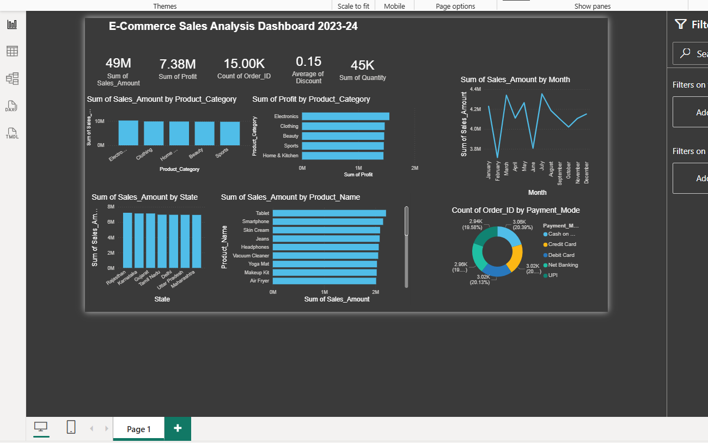

# Ecommerce_dashboard_powerbi

## 📊 Tools Used
- Microsoft Power BI

## 📌 Project Overview
Developed an interactive dashboard to analyze e-commerce sales data and customer behavior. The dashboard helps in understanding sales trends, product performance, and regional distribution.

## 📈 Key Features
- Sales analysis by category and product
- Customer and order trends
- Region-wise performance
- Interactive filters and visuals

## 📷 Dashboard Preview

## 📊 Key Insights
- Certain product categories drive majority of sales
- Sales vary significantly across regions
- Customer purchasing patterns show repeat trends
- High-performing products contribute major revenue share
